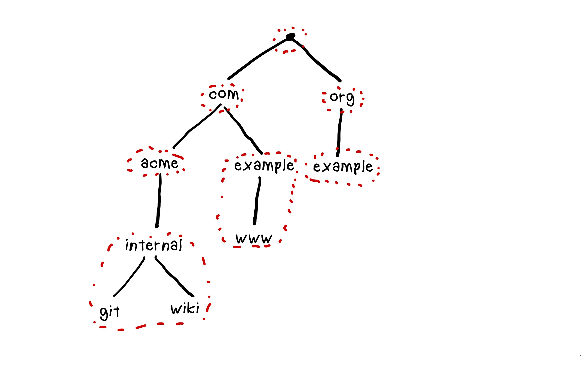
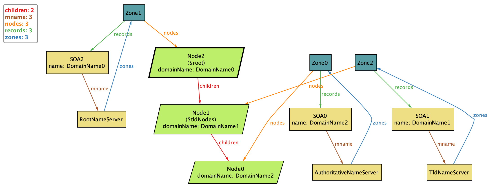

---
---
# Learning DNS by modeling it with ALloy

Alloy is a great tool to use for modeling an unfamiliar domain.
I've never really grokked how the DNS system works, and so DNS is a great domain to

* [RFC1034]

[RFC1034]: https://datatracker.ietf.org/doc/html/rfc1034

## Domain name space

The domain name space is a tree, where each node corresponds to a domain name. Here's an example from [RFC1034]:

```
                                   |
                                   |
             +---------------------+------------------+
             |                     |                  |
            MIL                   EDU                ARPA
             |                     |                  |
             |                     |                  |
       +-----+-----+               |     +------+-----+-----+
       |     |     |               |     |      |           |
      BRL  NOSC  DARPA             |  IN-ADDR  SRI-NIC     ACC
                                   |
       +--------+------------------+---------------+--------+
       |        |                  |               |        |
      UCI      MIT                 |              UDEL     YALE
                |                 ISI
                |                  |
            +---+---+              |
            |       |              |
           LCS  ACHILLES  +--+-----+-----+--------+
            |             |  |     |     |        |
            XX            A  C   VAXA  VENERA Mockapetris

```

Here's an alloy model.


```alloy
sig DomainName {}

sig Node {
	domainName: disj DomainName,
	children: set Node
}

fun parent[n : Node] : Node  {
	n.~children
}
```

Let's make sure the nodes form a tree:

```alloy
fact "nodes from a tree" {

	// no cycles
	no iden & ^children

	// fully connected
	// there's node from which every node is reachable (the root)
	some root : Node | Node in root.*children
}
```
## Records

DNS is a system that lets you look up records by domain name.
Let's model a record.


```alloy
abstract sig Record {
	name: DomainName
}
```

There are many different DNS record types, let's model some common ones:

```alloy
sig A extends Record {
	value: set IPv4Address
}

sig IPv4Address {}

sig AAAA extends Record {
	value: set IPv6Address
}

sig IPv6Address {}

sig CNAME extends Record {
	value: DomainName
}

pred noTwoRecordsHaveSameName[r: set Record] {
	all disj r1, r2: Record | no r1.name & r2.name
}

fact {
	noTwoRecordsHaveSameName[A]
	noTwoRecordsHaveSameName[AAAA]
	noTwoRecordsHaveSameName[CNAME]
}
```

## Zones

From [RFC1034]:

> every zone has at least one node, and hence domain name, for which it is authoritative, and all of the nodes in a particular zone are connected.

The domain name space is carved up into regions called *zones*.
Each zone is contiguous.
This means that the nodes in a graph make up a connected graph.
Since the entire graph is a tree, this means that every zone is also a tree.
The root of the tree in a zone is called the *apex* node.

Here's an example of a portion of the domain name space subdivided into zones, indicated by red circles.



Note: I just assumed the root, com, and org are all in separate zones, but I don't actually know.

Observe that:

* `example.com` and `www.example.com` are in the same zone
* `acme.com` and `internal.acme.com` are in separate zones


Note: because `com` and `org` are in separate zones, it isn't possible for `example.com` and `example.org` to be in the same zone.


Modeling it in Alloy:

```alloy
sig Zone {
	nodes: disj set Node,
	records: disj set Record
} {
	// at least one node
	some nodes

	// the nodes in a zone make upa connected graph
	all disj n1, n2 : nodes | (n1->n2 in ^children) or (n2->n1 in ^children)

	// all records are in a zone
	// All records are associated withe one of the owned nodes
	all r: records | r.name in nodes.domainName
}

fact "Every record is associated with exactly one zone" {
	all r: Record | one records.r
}
```

Apex of a zone:

```alloy
fun root[nodes: set Node] : Node {
	let r = children & (nodes -> nodes) |  {n : nodes | no (n & n.^r)}
}


fun apex[z: Zone] : Node {
	root[z.nodes]
}
```

## Name servers


A name server is associated with one or more zones.

```alloy
abstract sig NameServer {
	zones: set Zone
}

fact "every zone is associated with at least one name server" {
	all z : Zone | some zones.z
}
```

There are several kinds of name servers:

```alloy
// These are the servers that DNS clients talk to directly,
// e.g., your ISP's DNS server, Google's 8.8.8.8, Cloudflare's 1.1.1.1
// They resolve by calling all servers
sig RecursiveResolver extends NameServer {} {
	// these resolvers are not authoritative for any zones
	no zones
}

// Root name servers are associated with the root zone
sig RootNameServer extends NameServer {} {
	one zones
	zones.nodes = {n : Node | no parent[n] }
}


fun tldNodes[] : Node {
	// TLD nodes have parents bu
	{ n: Node | some parent[n] and no parent[parent[n]] }
}

// TLD name servers own TLD zones
sig TldNameServer extends NameServer {} {
	some zones
	zones.nodes in tldNodes[]
}

fact "TLD nodes are only in the zones of TLD name servers" {
	tldNodes[].~nodes in TldNameServer.zones
}


// Authoritative records for domains other than root and TLDs
sig AuthoritativeNameServer extends NameServer {} {
	some zones
	no zones & RootNameServer.@zones
	no zones & TldNameServer.@zones
}


```

We can now model SOA records, which contain references to name servers.

```alloy
sig SOA extends Record {
	mname: NameServer
} {
	// name server must have the zone associated with this record
	mname.zones in this.~records
}

fact "every zone has exactly one SOA record" {
	// all zones have one SOA record
	all z : Zone | one SOA & z.records

	// All SOA records are in one zone
	all r : SOA | one r.~records
}
```

## Visualizing

We can run this to generate a visualization of an instance of our model.

```alloy
run {
	some RootNameServer
	some TldNameServer
	some AuthoritativeNameServer

	all z : Zone | some z.records
}
```

